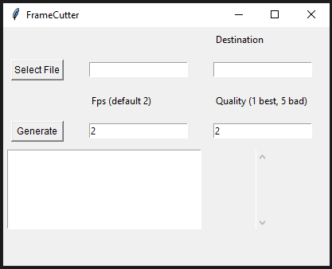

Certifique-se de ter o ffmpeg instaldo em seu computador [ffmpeg essential](https://github.com/GyanD/codexffmpeg/releases/download/2024-08-18-git-7e5410eadb/ffmpeg-2024-08-18-git-7e5410eadb-essentials_build.7z)

Comando para recopilar o programa ```bash pyinstaller --onefile --noconsole --icon=images/icon.ico --name=FrameCutter main.py ```

O FrameCutter é uma aplicação gráfica simples criada em Python com Tkinter. Seu objetivo é permitir que o usuário extraia frames de um vídeo usando o ffmpeg. O programa oferece uma interface amigável para que o usuário selecione o arquivo de vídeo, configure a taxa de frames por segundo (FPS) e a qualidade dos frames extraídos, e escolha o diretório onde os frames serão salvos.(Description by ChatGpt)


