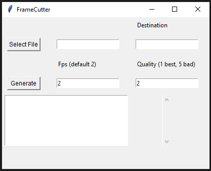

# FrameCutter

FrameCutter é uma aplicação gráfica simples criada em Python com Tkinter. Seu objetivo é facilitar a extração de frames de vídeos utilizando o FFmpeg. Com uma interface amigável, o programa permite que o usuário:

- Selecione o arquivo de vídeo de origem.
- Configure a taxa de frames por segundo (FPS).
- Ajuste a qualidade dos frames extraídos.
- Escolha o diretório onde os frames serão salvos.


<p align="center">
  
</p>


## Baixe a versão do FrameCutter [ aqui ](./dist/FrameCutter.exe)


# Compilando sua versão do FrameCutter
Certifique-se de ter o FFmpeg instalado em seu computador. Caso ainda não tenha, você pode fazer o download da versão essencial neste [link](https://github.com/GyanD/codexffmpeg/releases/download/2024-08-18-git-7e5410eadb/ffmpeg-2024-08-18-git-7e5410eadb-essentials_build.7z).

Para criar o executável do FrameCutter, execute o seguinte comando no terminal:

```bash
    pyinstaller --onefile --noconsole --icon=images/icon.ico --name=FrameCutter main.py
```

# Recursos
- Interface amigável: Usando a biblioteca Tkinter para criar uma experiência simples e intuitiva.
- Personalização de extração: Configure FPS e qualidade conforme necessário.
- Compatibilidade com FFmpeg: Aproveite o poder do FFmpeg para obter extrações rápidas e de alta qualidade.

## Licença
Este projeto está sob a licença MIT. Para mais detalhes, consulte o arquivo [LICENSE](./LICENSE.md).


